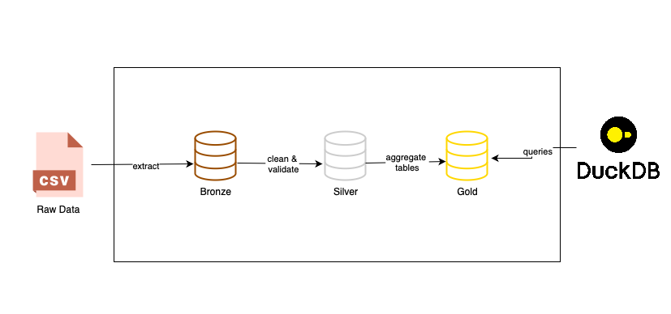
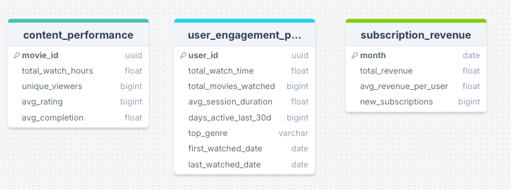

# Netflix Data Engineering Pipeline

## Project Overview

This project is an end-to-end Netflix-style data pipeline built with PySpark. It ingests multiple CSV sources, processes them through bronze, silver, and gold layers, and produces analytical tables that can be queried with SQL.

## What It Does

- Reads raw CSV datasets from the `data/` folder.
- Converts the raw inputs into parquet-based bronze and silver layers.
- Applies lightweight data quality checks such as deduplication, null filtering, and processed timestamps.
- Builds gold-layer aggregates for content performance, subscription revenue, and user engagement.
- Persists the final gold tables into a local DuckDB database for direct SQL exploration.

## Project Architecture



## Data Model



## Gold Layer Tables

The gold layer contains query-ready tables designed for analysis and reporting.

| Table Name | Description | Example Questions Answered |
|------------|-------------|----------------------------|
| `gold_content_performance` | Aggregates watch activity, completion, and rating signals by title. | Which titles have the highest total watch hours? Which movies get the best ratings? Which content performs best overall? |
| `gold_subscription_revenue` | Summarises subscriber counts and revenue trends by month and plan. | How much revenue was generated per month? Which plan brings in the most revenue? How many active subscribers do we have? |
| `gold_user_engagement_profile` | Combines watch, search, recommendation, and review activity into a user-level engagement profile. | Who are the most active users? Which users search and watch the most? How does engagement vary across segments? |

## Run The Pipeline

```bash
python src/main.py --source data --dest out
```

The pipeline writes parquet outputs to:

- `out/bronze`
- `out/silver`

The gold layer is stored in:

- `out/netflix_gold.duckdb`

You can query it with DuckDB after the pipeline finishes:

```sql
SELECT * FROM gold_content_performance;
```

## Source Data

The project uses sample datasets for movies, users, watch history, reviews, search activity, and recommendation logs.

## Notes

- Gold SQL scripts live in `src/sql`.
- DuckDB stores the final gold tables as queryable outputs.
- The pipeline is intentionally simple so it is easy to extend with more validation, testing, or orchestration later.